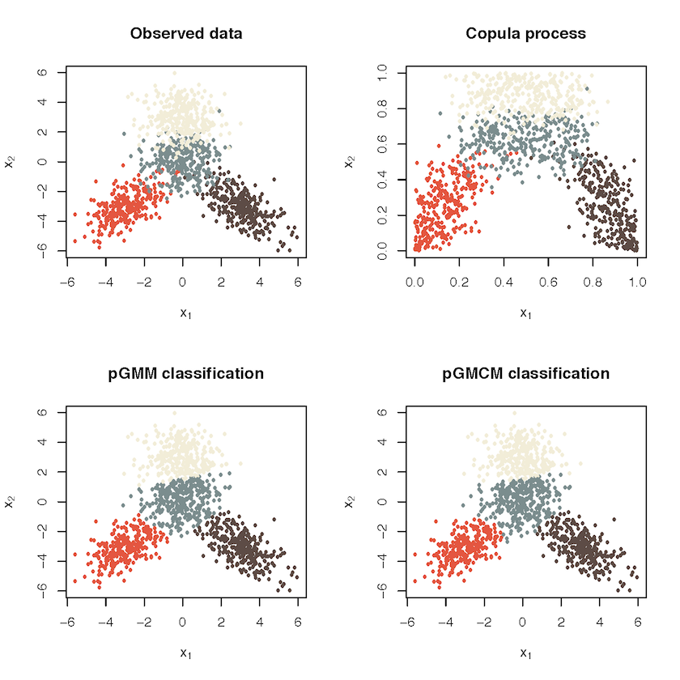

# pGMCM: Analysis with penalized Gaussian mixture copula models

The GMCM is a copula mixture that generalizes to any dimension. This package implements a general form of the pGMCM as well as a constrained version. It also implements a general and similarly constrained penalized Gaussian mixture model. The penalization allows for selection of the number of clusters, subject to a user-selected upper bound.

General case, with user-selected upper bound 10:

Constrained case with 9 components, with user-selected upper bound 9:

Constrained with 4 components, with user-selected upper bound 9:

### Dependencies
To use the full extent of this package, you need to download the C++ library LEMON graph library; [download it here.](https://lemon.cs.elte.hu/trac/lemon/wiki/Downloads)

<!---
LEMON citation:
Balázs Dezső, Alpár Jüttner, Péter Kovács. LEMON – an Open Source C++ Graph Template Library. Electronic Notes in Theoretical Computer Science, 264:23-45, 2011. Proceedings of the Second Workshop on Generative Technologies (WGT) 2010.
-->

You need a compiler that has support for C++11, such as

*   GCC: [see here, for example](https://www.gnu.org/software/gcc/projects/cxx-status.html#cxx11)
*   clang: [see here](http://clang.llvm.org/cxx_status.html)

*note: the R version is fully functional but the Julia code is just a test that cannot practically be used.*

